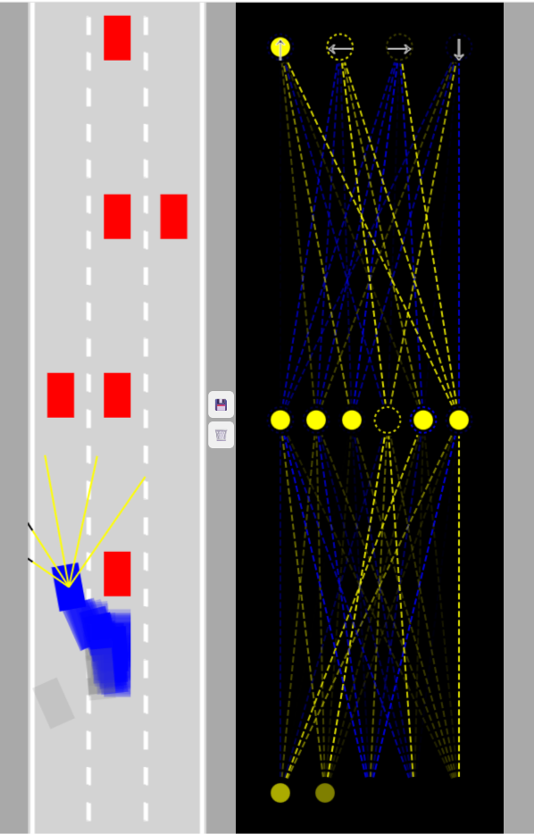
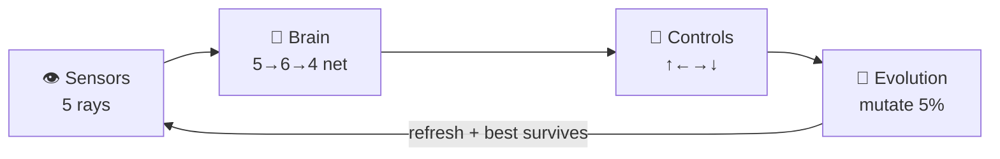

<div align="center">

# 🚗 Self-Driving Car in Vanilla JS

> A self-driving car simulation with neural network + genetic algorithm — 100 AI cars learn to drive with zero libraries.

[](.)
[](.)
[](.)
[](.)
[](LICENSE)

[Features](#-features) • [Quick Start](#-quick-start) • [How It Works](#-how-it-works) • [Customize](#️-make-it-yours) • [FAQ](#-faq)



*⬅️ 100 blue AI cars + red traffic & yellow LiDAR rays &nbsp;&nbsp;|&nbsp;&nbsp; 🧠 live neural-network brain ➡️*

</div>

---

## 🚀 Quick Start

Get driving in under 30 seconds — no install, no build:

```bash
git clone https://github.com/catcaptions/self-driving-car.git
cd self-driving-car
npx serve .   # then open http://localhost:3000
```

> No Node? Just double-click `index.html`. Python works too: `python -m http.server 8080`

**Evolve your first driver:**
1. Let it run ~30 seconds (cars will crash — that's learning)
2. Hit 💾 to save the best brain
3. Refresh the page for the next generation — repeat 5–10× and watch it learn to drive 🏁

---

## ✨ Features

| Feature | What you get |
|---|---|
| 🧬 Neuroevolution from scratch | Feedforward net `[5 → 6 → 4]` + mutation — no TensorFlow, no dataset |
| 🚗 100-car population | Parallel trial-and-crash simulation, best car highlighted every frame |
| 📡 Ray-cast LiDAR | 5 rays, 150px range, 90° spread with road + traffic intersection math |
| 📊 Live brain visualizer | Weights (yellow/blue), biases & activations rendered in real time |
| 💾 Persistent champion | Best brain saved to `localStorage`, cloned + mutated on reload |
| ⚡ Zero dependencies | ~800 lines of readable vanilla JS across 9 tiny files |

---

## 👀 What Am I Looking At?

| Left — `carCanvas` | Right — `networkCanvas` |
|---|---|
| 🛣️ 3-lane road, red dummy traffic | 🧠 Live brain of the current best car |
| 🔵 100 translucent blue AI cars | ⬇️ Bottom row = 5 sensor inputs |
| 💙 Solid blue = furthest (best) car | ◉ Middle = 6-neuron hidden layer |
| 📡 Yellow rays = LiDAR sensors | ⬆️ Top = 4 outputs: `↑ ← → ↓` |

Yellow connections = excitatory, blue = inhibitory. Dashed lines animate as signals flow.

---

## 🧠 How It Works



<details>
<summary><b>Click to see the 4-step loop in detail</b></summary>

### 1. 👁️ See — `sensor.js`
Each car casts 5 rays and finds the closest hit with road borders + traffic polygons:

```js
offsets = readings.map(s => s == null ? 0 : 1 - s.offset)
// obstacle close → ~1, clear road → 0
```

### 2. 🧠 Think — `network.js`
Tiny threshold network. No sigmoid, just:

```js
output = sum(inputs * weights) > bias ? 1 : 0
// outputs → [forward, left, right, reverse]
```

### 3. 🚗 Act — `car.js`
Simple kinematics: acceleration `0.2`, friction `0.05`, steering `0.03 rad/frame`. Polygon intersection = crash → `damaged = true`.

### 4. 🧬 Evolve — `main.js`
```js
const N = 100;                    // population
cars = generateCars(N);           // gen 0: random brains
bestCar = furthest car;           // fitness = distance
// on reload: clone champion → mutate all but #1 by 5%
NeuralNetwork.mutate(brain, 0.05);
```

Refresh = next generation. 💾 Save locks in progress to `localStorage`.

</details>

---

## 🎮 Controls

| Button | Action |
|---|---|
| 💾 Save | Stores `bestCar.brain` in `localStorage` |
| 🗑️ Trash | Clears saved brain — start evolution over |
| 🔄 Refresh | Spawns next generation (mutated from saved brain if present) |

---

## 🗂️ Project Structure

```
self-driving-car/
├── index.html          # two canvases + 💾/🗑️ buttons
├── style.css           # dark flex layout
├── main.js             # population loop, traffic, camera follow
├── car.js              # physics + brain → controls
├── sensor.js           # 5-ray caster + renderer
├── road.js             # 3-lane geometry + lane dashes
├── network.js          # Level + NeuralNetwork (feedForward + mutate)
├── visualizer.js       # live network renderer with ↑←→↓ labels
├── utils.js            # lerp, segment intersection, poly collision
└── assets/
    └── screenshot.png  # hero image 👆
```

Every file is < 160 lines — ideal for learning.

---

## ⚙️ Make It Yours

| File | Tweak | Effect |
|---|---|---|
| `main.js` | `N = 100` → `500` | Bigger population, faster learning, lower FPS |
| `sensor.js` | `rayCount = 5` → `9` | Wider perception (auto-resizes input layer) |
| `sensor.js` | `rayLenght = 150` → `250` | See further ahead |
| `car.js` | `[r, 6, 4]` → `[r, 8, 4]` | Larger hidden layer |
| `main.js` | `mutate(…, 0.05)` → `0.2` | More exploration, less stability |
| `main.js` | `traffic = […]` | Harder roads — more cars, lanes, speed |

<details>
<summary><b>💡 Extension ideas</b></summary>

- [ ] Fitness = speed + distance (not distance only)
- [ ] Elitism: keep top-5 brains, not just top-1
- [ ] Keyboard mode (`"KEYS"`) to drive yourself and record data
- [ ] Export/import champion as JSON — share brains!
- [ ] NEAT-style topology evolution
- [ ] Responsive canvases + touch controls for mobile

</details>

---

## ❓ FAQ

**Why do all cars crash at first?**
That's generation 0 — random weights. Save + refresh a few times and the population converges. Evolution needs ~5–10 generations to look competent.

**Where is the brain stored?**
`localStorage` key `bestBrain` (JSON). Hit 🗑️ or run `localStorage.removeItem("bestBrain")` to reset.

**Can I change the road / traffic?**
Yes — edit the `traffic` array in `main.js` (lane, position, speed). Road lanes default to 3 in `road.js`.

**Why vanilla JS, no ML library?**
So every line is readable. The whole net is ~60 lines in `network.js` — you can trace a sensor reading to a steering decision by hand.

---

## 🤝 Contributing

1. Fork → `git checkout -b feature/your-idea`
2. Keep it dependency-free if possible
3. Open a PR with a screenshot/GIF of what changed — visual proof beats prose

Issues with `screenshot` + steps to reproduce get fixed first.

---

## 📄 License

MIT © catcaptions — see [LICENSE](LICENSE). Use it for learning, teaching, or your own experiments.

Inspired by Radu Mariescu-Istodor's *"Self-driving car with JavaScript"* course.

<div align="center">

[](https://star-history.com/#catcaptions/self-driving-car&Date)

**If this helped you grok neural nets, leave a ⭐ — it helps others find it.**

Built with ☕ + 📐 + 🧬 — no frameworks were harmed.

</div>
